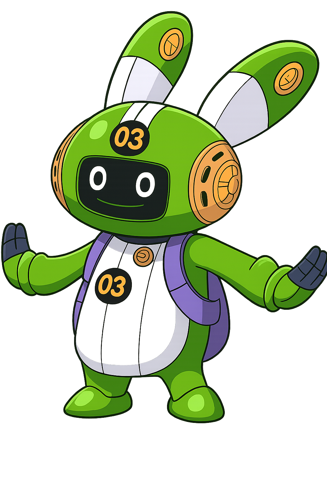

<div align="center">
  
</div>

# <span style="color: #2563eb;">🧠 EdisonAI</span>
### <span style="color: #1e40af;">The Thinking Satellite - Your Private AI Laboratory</span>

---

## <span style="color: #7c3aed;">✨ Vision</span>

Like **Dr. Vegapunk's Edison satellite** - the embodiment of pure thinking and innovation - EdisonAI represents the **thinking aspect** of artificial intelligence that you control. This self-hostable chat application connects to your own Supabase backend and allows you to use your own API keys for various Large Language Models (LLMs). 

Just as Edison constantly brainstorms ideas and devises strategies in the One Piece universe, EdisonAI provides you with a **transparent laboratory** for AI experimentation, built with **privacy** and **intellectual freedom** as core principles.

---

## <span style="color: #059669;">🎯 Key Benefits</span>

### <span style="color: #0891b2;">🧠 The Edison Advantage</span>
Like Vegapunk's genius satellite, EdisonAI embodies pure **thinking and innovation**. Every conversation becomes a laboratory experiment where you control the variables, the data, and the outcomes.

### <span style="color: #0891b2;">🔍 Complete Transparency</span>
The full source code is available - inspect every line of your AI laboratory. There's no hidden telemetry or tracking, just like a true scientist's open research.

### <span style="color: #0891b2;">🔒 Your Private Laboratory</span>
Your conversations and experiments are stored in your own private Supabase database. You own your research data, your breakthroughs, and your intellectual discoveries.

### <span style="color: #0891b2;">🔑 Bring Your Own Intelligence (BYOI)</span>
Connect to multiple AI models (Groq, Google Gemini, and more) using your own API keys. Mix and match different AI "satellites" for your experiments.

### <span style="color: #0891b2;">🔄 Adaptive Thinking</span>
Switch between different AI models seamlessly, just like accessing different aspects of Vegapunk's genius through his various satellites.

### <span style="color: #0891b2;">🏠 Self-Hosted Innovation Hub</span>
Deploy your entire AI laboratory to your own environment for maximum control over your thinking processes and innovations.

### <span style="color: #0891b2;">🖼️ Visual Intelligence (Coming Soon)</span>
Future updates will include image analysis capabilities, expanding your AI laboratory to process visual data alongside text conversations.

---

## <span style="color: #dc2626;">🚀 Getting Started</span>

Follow these steps to set up your own EdisonAI laboratory locally.

### <span style="color: #ea580c;">1. Set Up Supabase</span>

First, you'll need a free Supabase account to act as your private research database.

#### <span style="color: #f59e0b;">📝 Create a Project</span>
- Go to [supabase.com](https://supabase.com)
- Sign up and create a new project
- You can name it whatever you like (e.g., `EdisonAI-Lab`)

#### <span style="color: #f59e0b;">🗄️ Run the Database Migration</span>
1. In your Supabase project dashboard, navigate to the **SQL Editor**
2. Click **+ New query**
3. Open the `supabase/migrations/20250808100052_rough_snowflake.sql` file from this repository
4. Copy its entire content, paste it into the Supabase SQL editor, and click **RUN**
5. This will create the `chats` and `messages` tables

#### <span style="color: #f59e0b;">🔐 Get API Credentials</span>
1. In your project dashboard, go to **Project Settings** (the gear icon)
2. Select the **API** tab
3. You will need two values from this page:
   - **Project URL**
   - **anon public key**
4. Keep this page open for the next step

---

### <span style="color: #ea580c;">2. Get Your LLM API Keys</span>

EdisonAI is designed to work with multiple AI "satellites" using your own API keys. Here's how to connect to different aspects of AI intelligence.

#### <span style="color: #f59e0b;">⚡ Groq API Key (For High-Speed Inference)</span>
1. Go to [groq.com](https://groq.com) and sign up for a free account
2. Navigate to the **API Keys** section
3. Create a new API key, give it a name, and copy the key value

#### <span style="color: #f59e0b;">🤖 Google Gemini API Key</span>
1. Go to [Google AI Studio](https://aistudio.google.com)
2. Sign in with your Google account
3. Click **Get API key** from the top left menu
4. Create a new API key
5. You may need to create a new Google Cloud project if you don't have one already
6. Copy the generated API key

---

### <span style="color: #ea580c;">3. Configure and Run the Application Locally</span>

#### <span style="color: #f59e0b;">📦 Clone the Laboratory</span>
```bash
git clone https://github.com/your-username/edisonai.git
cd edisonai
```

#### <span style="color: #f59e0b;">⬇️ Install Dependencies</span>
```bash
npm install
```

#### <span style="color: #f59e0b;">⚙️ Create Environment File</span>
Create a new file in the root of the project named `.env.local`. Copy the following into it:

```env
VITE_SUPABASE_URL=YOUR_SUPABASE_PROJECT_URL
VITE_SUPABASE_ANON_KEY=YOUR_SUPABASE_ANON_KEY
VITE_GROQ_API_KEY=YOUR_GROQ_API_KEY
VITE_GEMINI_API_KEY=YOUR_GEMINI_API_KEY
```

#### <span style="color: #f59e0b;">🔧 Add Your Credentials</span>
- Replace `YOUR_SUPABASE_PROJECT_URL` and `YOUR_SUPABASE_ANON_KEY` with the values you got from the Supabase settings
- Replace `YOUR_GROQ_API_KEY` and `YOUR_GEMINI_API_KEY` with the keys you generated

#### <span style="color: #f59e0b;">🎉 Start Your AI Laboratory</span>
```bash
npm run dev
```

Your EdisonAI laboratory should now be running on [http://localhost:5173](http://localhost:5173). Begin your AI experiments!

> **💡 Edison's Tip:** The application includes a settings panel where you can switch between different AI satellites and update your API keys without restarting your laboratory.

---

## <span style="color: #7c2d12;">🛡️ Research Ethics & Security</span>

- **Your experiments stay private** - All conversations are stored in your private Supabase research database
- **Open science principles** - Inspect every algorithm and process in your AI laboratory
- **No corporate surveillance** - Zero telemetry or analytics collection from your research
- **API key sovereignty** - Your AI connections are stored locally and never transmitted to external servers

---

## <span style="color: #4c1d95;">🔬 Future Laboratory Expansions</span>

### <span style="color: #7c3aed;">🖼️ Visual Intelligence Module</span>
Coming soon: Image analysis capabilities that will allow EdisonAI to process and understand visual data alongside text conversations. Upload images, analyze diagrams, extract text from pictures, and engage in visual reasoning - expanding your AI laboratory's capabilities beyond text.

**Planned Features:**
- Image upload and analysis
- Visual question answering
- Diagram interpretation
- OCR (Optical Character Recognition)
- Multi-modal conversations combining text and images

### <span style="color: #7c3aed;">🧪 Additional AI Satellites</span>
Future integration with more AI models to expand your experimental capabilities, just like Vegapunk's multiple specialized satellites.

---

## <span style="color: #365314;">🤝 Contributing</span>

We welcome fellow researchers and innovators! Please feel free to submit issues, feature requests, or pull requests to help advance the EdisonAI laboratory.

---

## <span style="color: #4c1d95;">📄 License</span>

This project is open source and available under the [MIT License](LICENSE).

---

<div align="center">
  <strong><span style="color: #2563eb;">Built with 🧠 for the thinking minds who value innovation and privacy</span></strong><br>
  <em><span style="color: #7c3aed;">"In the spirit of Edison - constantly thinking, constantly innovating"</span></em>
</div>